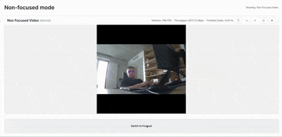

# Focused Vision (PoC)

This example demonstrates a **focused-vision pipeline** with a small **custom frontend**.
On the DepthAI backend, the app produces three streams with per-stream annotations:

- **Video** (full scene) → annotation: **Face stage 1**
- **Face Mosaic** (high‑res face crop) → annotation: **Eyes (Crops)**
- **Non Focused Video** (downscaled/global) → annotation: **Eyes (Non-Focused)**

The frontend, built using the `@luxonis/depthai-viewer-common` package, displays real-time streams:
- **Focused mode** → shows **Video** and **Face Mosaic** (two panels)
- **Non‑focused mode** → shows **Non Focused Video** (one panel)

Annotations are grouped so each appears **only on its matching stream** in the custom frontend.

> **Note:** This app can run either:
> - in **Standalone mode (RVC4)** with the **custom frontend** and grouped annotations, or
> - in **Peripheral mode** (host-controlled) using the **default viewer**; in this mode, annotations are **not grouped** and will be **mixed** across streams.

## Demo



## Usage

Running this example requires a **Luxonis device** connected to your computer. Refer to the [documentation](https://docs.luxonis.com/software-v3/) to set up your device if you haven't already.

Here is a list of all available parameters:

```
-d DEVICE, --device DEVICE
                    Optional name, DeviceID or IP of the camera to connect to. (default: None)
-fps FPS_LIMIT, --fps-limit FPS_LIMIT
                    FPS limit. (default: None)
-ip IP, --ip IP     IP address to serve the frontend on. (default: None)
-p PORT, --port PORT  Port to serve the frontend on. (default: None)
```

### Prerequisites

Before running the example you’ll need to build the frontend. Follow these steps:

1. Install FE dependencies: `cd frontend/ && npm i`
2. Build the FE: `npm run build`
3. Move back to origin directory: `cd ..`

## Standalone Mode (RVC4 only)

Running the example in standalone mode, the app runs on the device **with the custom frontend and grouped annotations**.

To run the example in this mode, first install the `oakctl` tool using the installation instructions [here](https://docs.luxonis.com/software-v3/oak-apps/oakctl).

The app can then be run with:

```bash
oakctl connect <DEVICE_IP>
oakctl app run .
```

Once the app is built and running you can access the DepthAI Viewer locally by opening `https://<OAK4_IP>:9000/` in your browser (the exact URL will be shown in the terminal output).

### Remote access

1. You can upload the oakapp to Luxonis Hub via `oakctl`.
2. Then you can remotely open the App UI via the App detail page (WebRTC).

## Peripheral Mode (host-controlled)

In Peripheral mode, the pipeline runs from your host and the **default viewer** is used (not the custom frontend).
**Important:** the default viewer does **not** support per-stream annotation grouping, so annotations will be **mixed** across streams.

Run:

```bash
cd backend/src
python3 main.py
```
