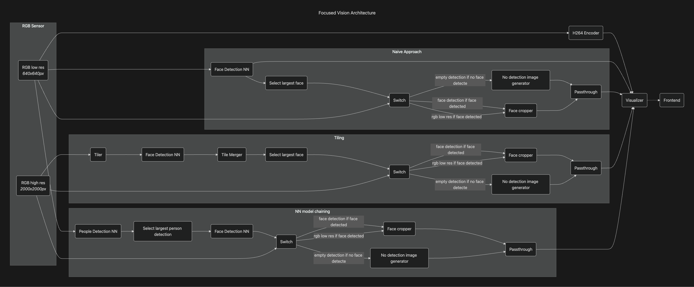

# Focused Vision

The goal of **Focused Vision** is to capture an object of interest in as much detail as possible and to do all necessary
steps on-device. It excels when the object occupies only a small part
of the image - whether because it is physically small, relatively far from the camera, or both.

This application compares a naive face-detection approach with two **Focused Vision** approaches
using person detection and tiling.

> **Note:** This example works only on RVC4 in standalone mode.

## Demo


## Architecture



## Naive approach

Detects faces on downscaled (320x240px) low-res RGB

## NN model chaining

This approach uses a **two-stage neural-network pipeline** for significantly improved face-detection reliability.

1. **Stage 1 – Person Detection:**
   A person is detected on the full 2000×2000 high-resolution image. The person region is then cropped at full detail.

1. **Stage 2 – Face Detection on the Crop:**
   The face detector runs on the cropped person image, downscaled to 320×240—the same input size used in the naïve approach.

The key difference is where the downscaling happens.

•	In the **naïve approach**, the **entire image** is downscaled to 320×240 before face detection,
causing the face to become small and lose detail.

•	In the **NN chaining approach**, only the **high-resolution person crop** is downscaled,
preserving far more facial detail in the model’s input.

As a result, the face detector receives a clearer, more information-rich image, which **substantially increases
the chance of successful face detection.**

## Tiling

Tiling is a **brute-force approach** that increases face-detection reliability
by splitting the high-resolution image into multiple overlapping regions (tiles).
Each tile is then independently **downscaled to 320×240** and passed through the face-detection model.

Because each tile represents only a **small portion** of the original image,
more facial detail is preserved compared to downscaling the entire frame at once—making detection more likely.

This method is particularly useful when the **NN Model Chaining** technique cannot be applied.
However, it is **computationally expensive**.
In this application, a **2×2 tiling pattern** is used, producing 4 tiles.
Since the face-detection model must run on every tile, a 15 FPS camera effectively requires the
neural network to process **4× the number of frames**, greatly increasing processing load.

## Usage

Running this example requires a **Luxonis device** connected to your computer. Refer to the [documentation](https://docs.luxonis.com/software-v3/) to set up your device if you haven't already.

## Standalone Mode (RVC4 only)

To run the example in this mode, first install the `oakctl` tool using the installation instructions [here](https://docs.luxonis.com/software-v3/oak-apps/oakctl).

The app can then be run with:

```bash
oakctl connect <DEVICE_IP>
oakctl app run .
```

Once the app is built and running you can access the DepthAI Viewer locally by opening `https://<OAK4_IP>:9000/` in your browser (the exact URL will be shown in the terminal output).

### Remote access

1. You can upload the oakapp to Luxonis Hub via `oakctl`.
1. Then you can remotely open the App UI via the App detail page (WebRTC).

# Development

This example runs with default argument values. If you’d like to customize it, you can use it as a starting point and modify the source code, which is available [here](https://github.com/luxonis/oak-examples/edit/main/apps/focused-vision/).
For more examples, check out our app store or browse the [oak-examples](https://github.com/luxonis/oak-examples) repository.
