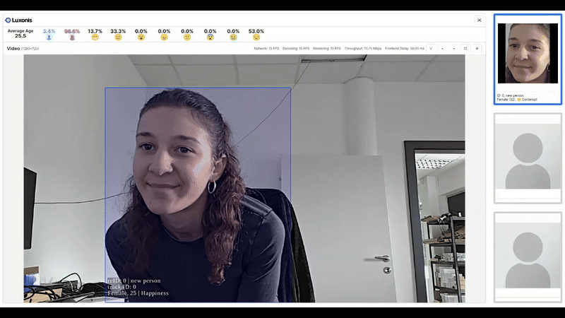

# People Demographics and Sentiment Analysis

This application performs real-time person analytics on Luxonis RVC4 devices.
It detects people and faces, tracks individuals over time, estimates age, gender, emotion and performs re-identification (recognizes if a person has been in the scene before or if it's a new person).

> **Note:** This example works only on RVC4 in standalone mode.

The app showcases:

- Live annotated Video stream
- Recency-ordered face panel (last seen people)
- Statistics panel (average age, gender ratio, emotion distribution)



## Usage

Running this example requires a **Luxonis device** connected to your computer. Refer to the [documentation](https://docs.luxonis.com/software-v3/) to setup your device if you haven't done it already.

## Standalone Mode (RVC4 only)

Running the example in the standalone mode, app runs entirely on the device.
To run the example in this mode, first install the `oakctl` tool using the installation instructions [here](https://docs.luxonis.com/software-v3/oak-apps/oakctl).

The app can then be run with:

```bash
oakctl connect <DEVICE_IP>
oakctl app run .
```

Once the app is built and running you can access the DepthAI Viewer locally by opening `https://<OAK4_IP>:9000/` in your browser (the exact URL will be shown in the terminal output).

This will run the example with default argument values (YOLO-World model). If you want to change these values you need to edit the `oakapp.toml` file (refer [here](https://docs.luxonis.com/software-v3/oak-apps/configuration/) for more information about this configuration file).

### Remote access

1. You can upload oakapp to Luxonis Hub via oakctl
2. And then you can just remotly open App UI via App detail
