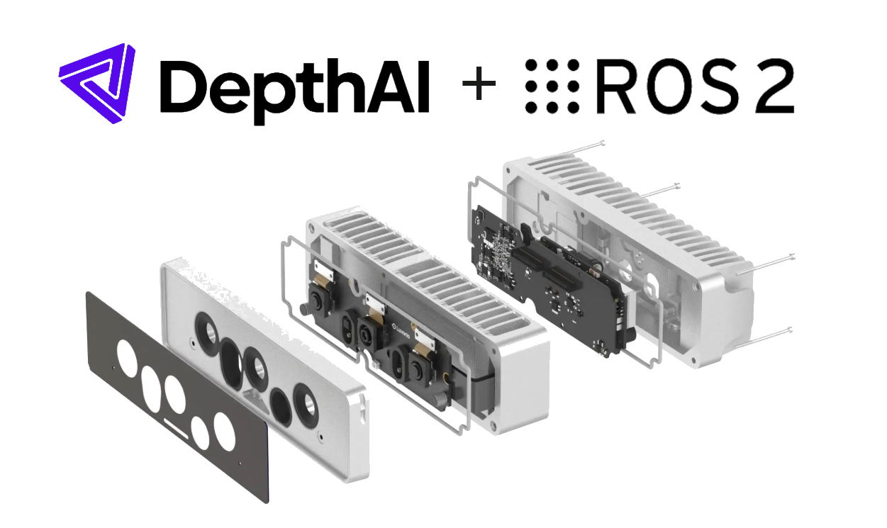

# ROS driver custom workspace example


This is an example of an app that allows creating custom workspaces that contain your nodes which can be serve as entrypoint to your whole ROS2 project.
You can use that as a template for developing your custom ROS2 codebase, just use `src` directory the same way you would do that in your ROS2 workspace.
When running the app, the build process downloads dependencies and performs colcon build on the workspace. You can refer to `oakapp.toml` file on individual build steps.
This example uses ROS2 Kilted as the default distribution as this is the only one that is currently supported.

## Example packages

In `src` directory you can find two example packages, `example_package` and `dai_ros_plugins`. `example_package`  serves as the entrypoint and showcase of how one would set it up.
`dai_ros_plugins` serves as an example on how to create a custom pipeline plugin for `depthai_ros_driver`. You can use the plugin developed inside as a blueprint for further development.

## Troubleshooting

If you encounter issues with topic names or data types, verify that your ROS2 distribution matches the one used in the example.
You may need to adjust topic names or data types accordingly.

```bash
sudo apt install ros-$ROS_DISTRO-rmw-cyclonedds-cpp
export RMW_IMPLEMENTATION=rmw_cyclonedds_cpp
```
